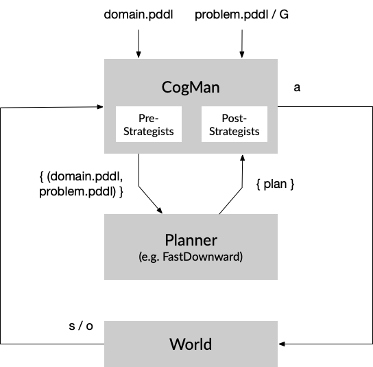

# LEAP (Learning-Enabled Abstraction for Planning)



* CogMan: cognitive manager that employs strategists and commonsense knowledge to solve big, complex problems
	* Pre-problem Strategists: a sequence of (learned) components that map a big problem into a sequence of smaller problems by making hierarchical or temporal abstractions
		* HPN: (v1) relax preconditions with fixed hierarchy (v2) with learned importance score
		* PLOI: (v1) find minimum set of objects at the beginning of solving the problem (v2) change the set dynamically
		* C2S2 (context-conditioned subgoal suggestor): (v1) with 3-gram models (v2) with language models 
	* Post-problem Strategists: a sequence of components that improve a plan 
		* VNS: to change the order of operators, e.g. open the fridge only once to get both the meat and cheese
* Planner: FastDownward (better than PyperPlan in that it can take ADL expressions for using forall/exists/when in precond/effects)

## Usage

Run `run.py` with the domain and problem pddl files, along with the sequence of strategists to use. The code searches for the pddl files in all sub-directories of `domain/`.

```python
python run.py domain.pddl problem.pddl -s hpn,c2s2
```

The output includes a plan and a log:  `output/domain_problem_sln.pddl`,  `output/domain_problem_sln.log`

### Available Strategists

* hpn: output the original domain and problem pddl

## Domains

### Kitchen domain